# API REST

# Trabajo Práctico - Api Rest  **Programación IV** - TUP UTN.

Desarrollar una API REST completa y profesional para la gestión de productos,
aplicando arquitectura en capas, validaciones, manejo de errores, persistencia con
Spring Data JPA y documentación con Swagger.

El proyecto fue desarrollado utilizando el patrón arquitectónico de diseño **MVC (Model-View-Controller)** adaptado para APIs REST, separando las responsabilidades en las siguientes capas:

*   **Controllers:** Manejo de peticiones HTTP y mapeo de endpoints.
*   **Services:** Lógica de negocio, cálculos de subtotales/totales y seguridad transaccional (`@Transactional`).
*   **Repositories:** Acceso a datos utilizando Spring Data JPA.
*   **Entities:** Modelado de base de datos relacional con Hibernate.
*   **DTOs (Data Transfer Objects):** Patrón utilizado rigurosamente para aislar la base de datos y controlar la entrada/salida de datos (Ej: `PedidoCreate`, `CategoriaDto`).

## Configuración y Ejecución

La base de datos utilizada es **H2 en memoria**, lo que garantiza que el proyecto sea 100% portable y no requiera configuraciones externas.

1. Clonar el repositorio.
2. Sincronizar las dependencias de Gradle (build.gradle.kts).
3. Ejecutar la clase principal `EjemploSpringApplication.java`.
4. La API estará disponible para ser consumida a través de Postman (o cualquier cliente HTTP) utilizando la ruta base: `http://localhost:8080/api/`

## Documentación OpenAPI (Swagger)

La API se encuentra completamente documentada. Una vez ejecutada la aplicación, se puede acceder a la interfaz interactiva de Swagger UI en:

**[http://localhost:8080/swagger-ui/index.html](http://localhost:8080/swagger-ui/index.html)**

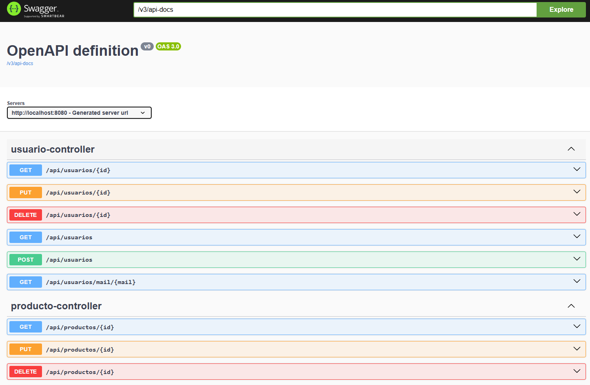
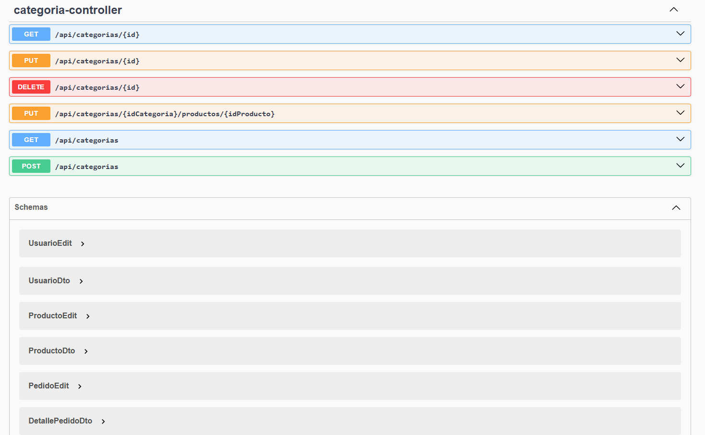

## 📸 Pruebas de Funcionamiento (Postman)

### Creación de Usuarios y Categorías (Puntos 5a y 5c)

#### 1. Crear 2 Usuarios (POST a http://localhost:8080/api/usuarios)
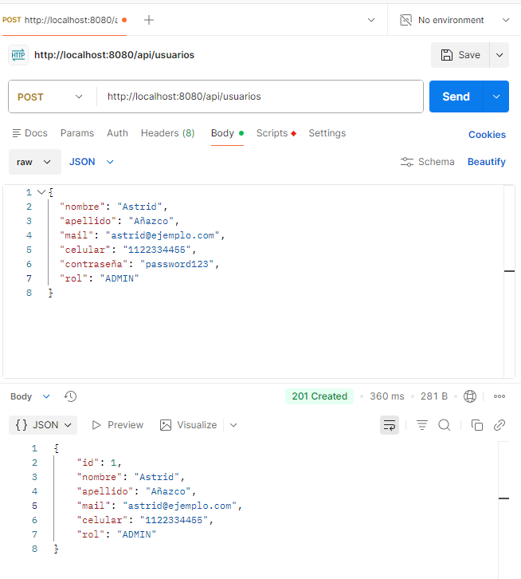
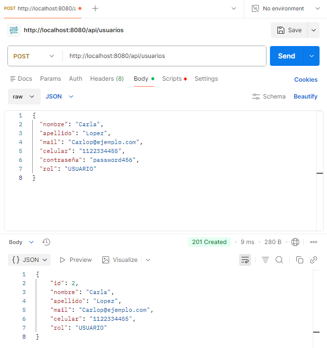

####  2. Crear 3 categorias (POST a http://localhost:8080/api/categorias)
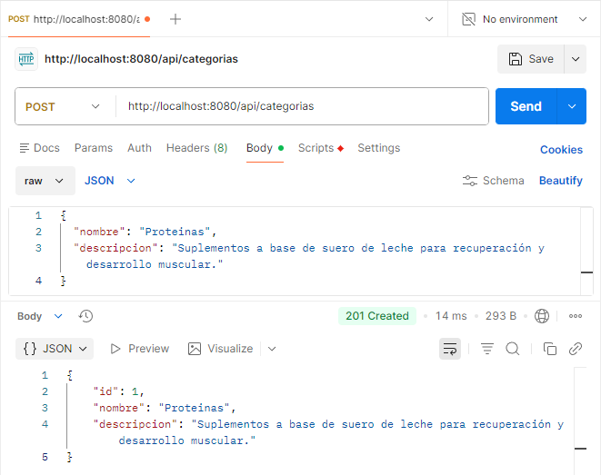
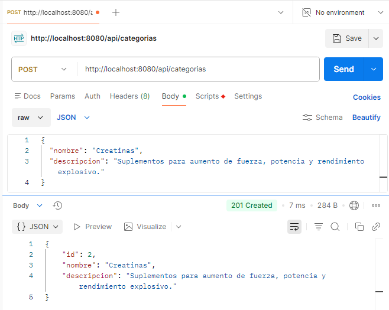
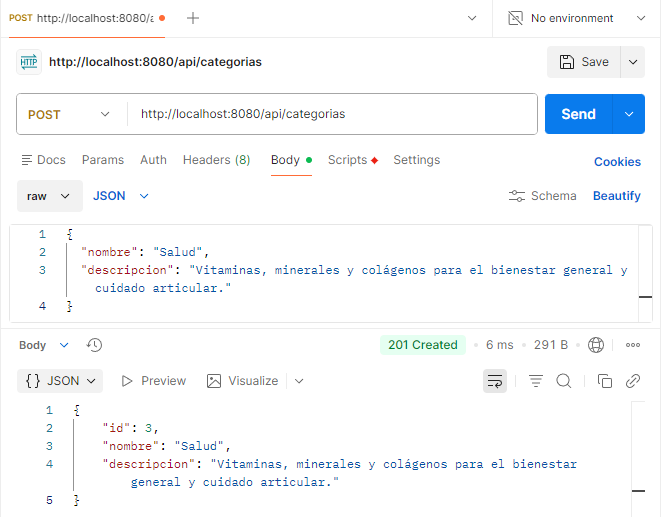

#### 3. Carga de 10 Productos (POST a http://localhost:8080/api/productos)
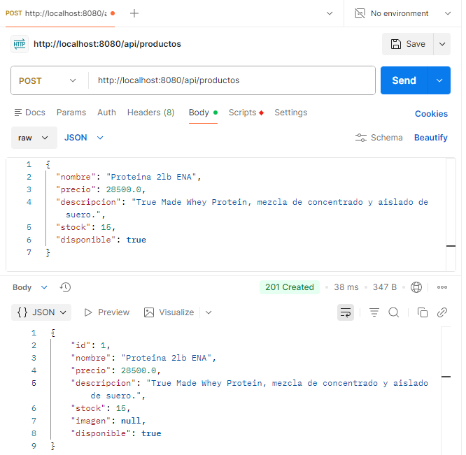 
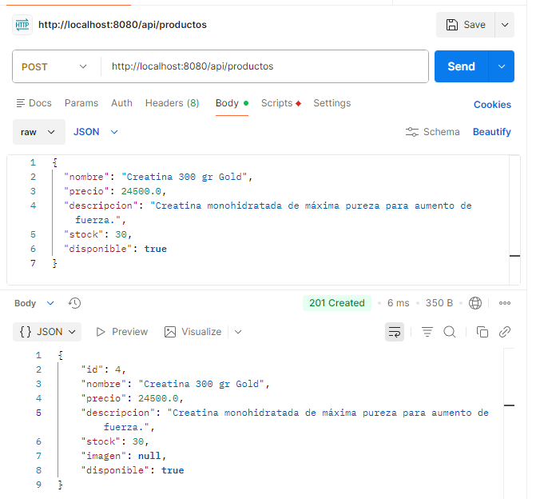
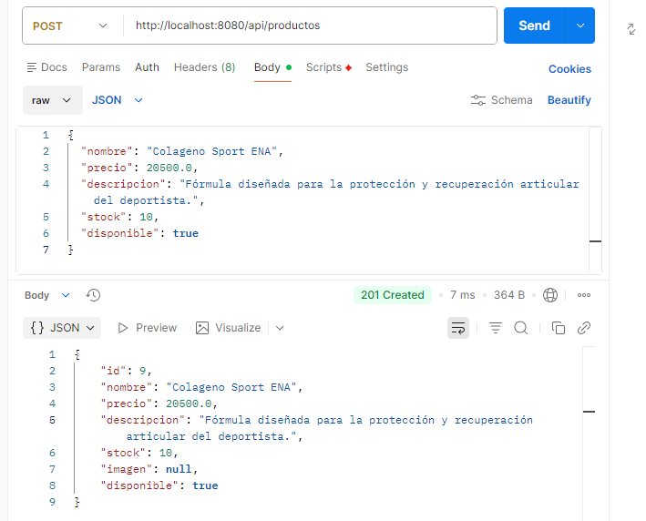

#### 4. Creacion de 3 Pedidos
#### 1er pedido

`{
    "fecha": "2026-09-07",
    "estado": "PENDIENTE",
    "formaPago": "EFECTIVO",
    "detalles": [
        {
            "cantidad": 1,
            "idProducto": 1
        },
        {
            "cantidad": 1,
            "idProducto": 2
        }
    ]
}`

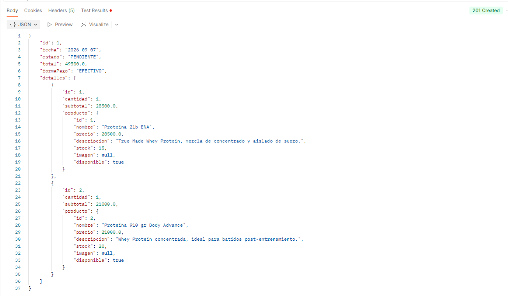

#### 2do pedido 

`{
"fecha": "2026-09-08",
"estado": "CONFIRMADO",
"formaPago": "TARJETA",
"detalles": [
{
"cantidad": 2,
"idProducto": 4
},
{
"cantidad": 1,
"idProducto": 8
}
]
}`

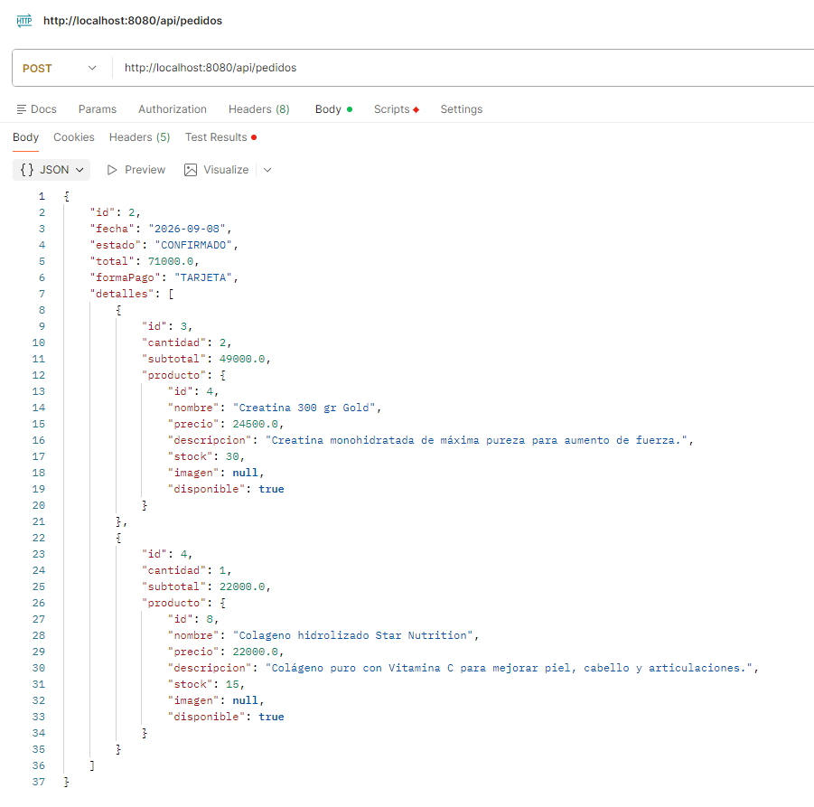

#### 3er pedido 
`{
  "fecha": "2026-09-08",
  "estado": "TERMINADO",
  "formaPago": "TRANSFERENCIA",
  "detalles": [
    {
      "cantidad": 3,
      "idProducto": 3
    },
    {
      "cantidad": 2,
      "idProducto": 10
    }
  ]
}`

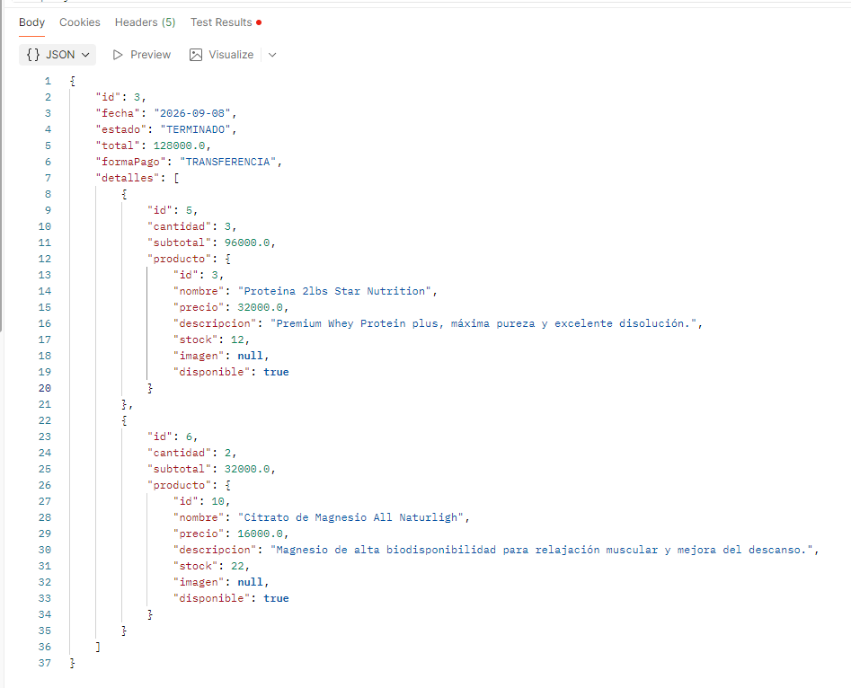

### 5. Actualizaciones y Busquedas 

### Actualizar una Categoria 

#### PUT a http://localhost:8080/api/categorias/1

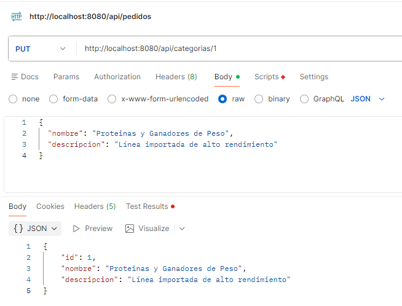

### Buscar Usuarios por ID y por mail 

#### Buscar por ID: GET a http://localhost:8080/api/usuarios/1

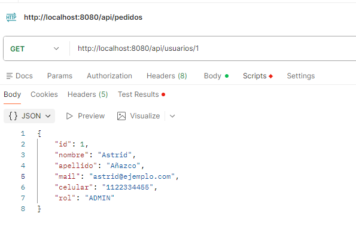

#### Buscar por Mail: GET a http://localhost:8080/api/usuarios/mail/astrid@ejemplo.com

findByMailIgnoreCase, ignora mayusculas al comparar

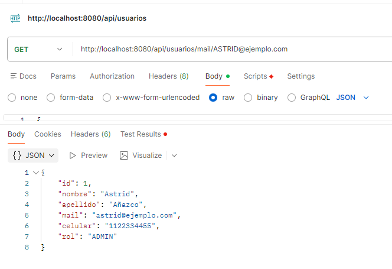

## Feature Extra: Vinculación Dinámica (Categoría-Producto)

Para mantener una alta cohesión, se implementó un endpoint de vinculación `PUT /{idCategoria}/productos/{idProducto}` que permite asociar mercadería a categorías existentes.

Al consultar la categoría, el patrón DTO se encarga de serializar dinámicamente la lista de productos asociados.

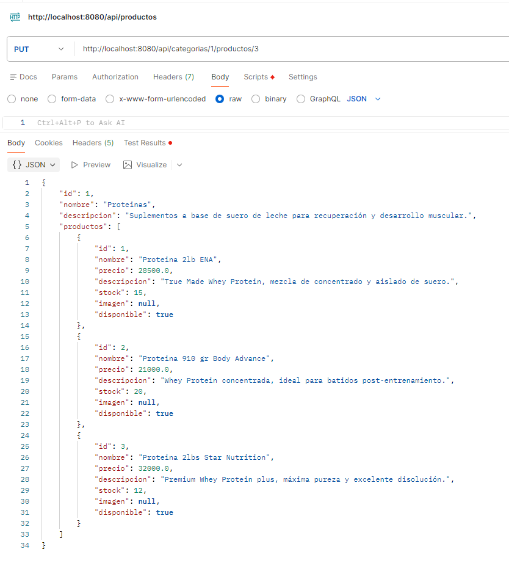